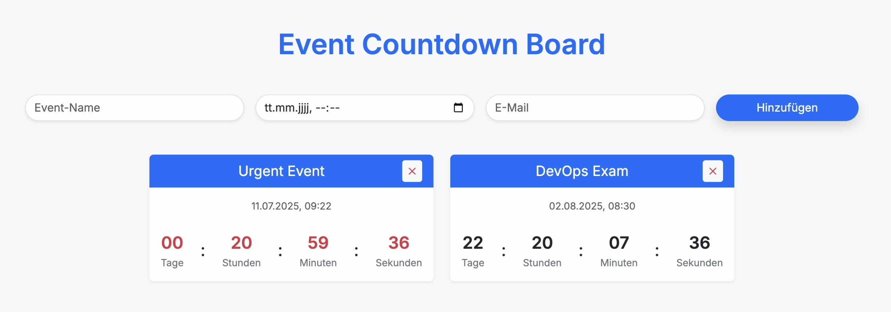

# A Simple Cloud Native App: Create and Delete Countdowns for Upcoming Events



A simple cloud-native app that fully implements the key Kubernetes (K8s) concepts. Everything can be deployed via a Helm chart. The app allows users to create and remove countdowns for events. Once an event is less than 24 hours away, a notification is sent via email using the fake SMTP service Mailhog.

- **Deployment 1:** HTML and JS for the UI, Python and FastAPI for the API  
- **Deployment 2:** Fake SMTP (Mailhog) and inbox for testing emails 
- **Service:** NodePort for accessing the website via browser  
- **StatefulSet, Volume:** Persistent database (Postgres)  
- **CronJob:** Checks every 5 minutes if an event is < 24h away and sends a notification email (Notifier)  
- **RBAC:** ServiceAccount, Role, RoleBinding for the Notifier  
- **ConfigMap (nginx-conf), Secret (db-secret):** HTTP routing and DB password  
- **LimitRange, ResourceQuota:** CPU and memory limits, as well as namespace budget

---

## Demo Videos
(Download the videos to watch them)
[▶️ Countdown Board Demo](demo-videos/countdown-board1.mp4)

[▶️ Pods, jobs and more](demo-videos/countdown-board2.mp4)

[▶️ Mail notification logs](demo-videos/countdown-board3.mp4)

[▶️ API logs](demo-videos/countdown-board4.mp4)

[▶️ Database logs](demo-videos/countdown-board5.mp4)

---

### Container Registry

After testing in the DEV environment, I pushed the images for the UI, Notifier, and API to the GitLab Container Registry for deployment in PROD.

Example for pushing the UI image to the registry:  
```bash
docker buildx build --platform linux/amd64 -t $REG/countdown-ui:$TAG ./src/ui --push
```
